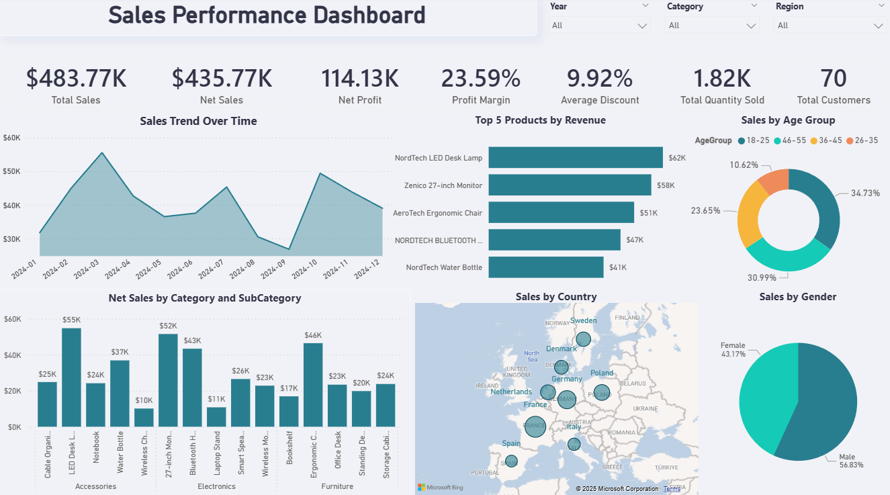

# PowerBI Sales Analytics Dashboard V2.0

An interactive Power BI dashboard for tracking sales performance, revenue trends, and customer insights.

## 📸 Preview

## ✨ Features

- **KPI Summary** – Total Sales, Net Sales, Net Profit, Profit Margin, Average Discount, Quantity Sold, Total Customers
- **Sales Trend Over Time** – Monthly sales trend visualization
- **Top 5 Products by Revenue** – Best-performing products
- **Net Sales by Category & Subcategory** – Breakdown across Accessories, Electronics, and Furniture
- **Sales by Country** – Geographic sales distribution map
- **Sales by Age Group & Gender** – Customer demographic insights
- **Interactive Filters** – Filter by Year, Category, and Region

## 🛠️ Tech Stack

- Power BI
- DAX
- Data Modeling

**Author:** [Your Name](https://github.com/samiremon)
